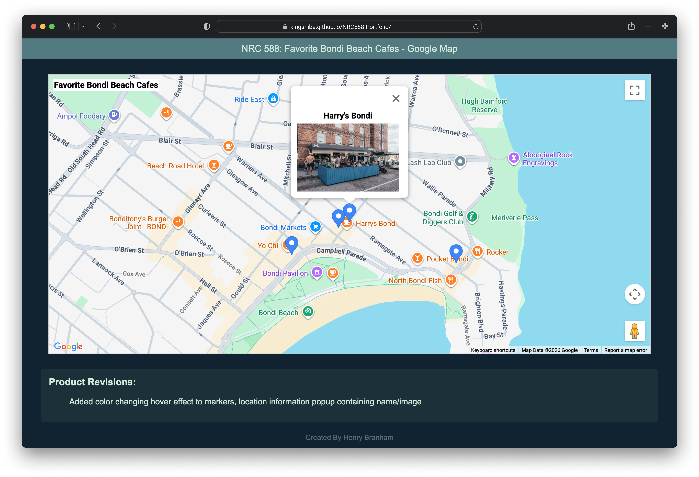
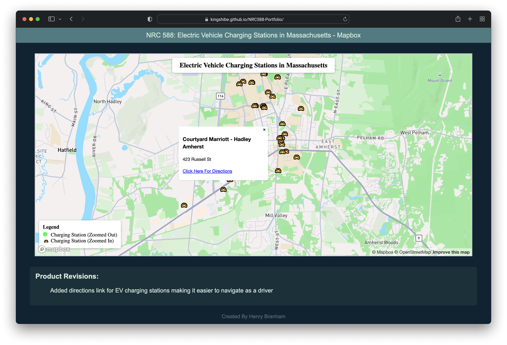
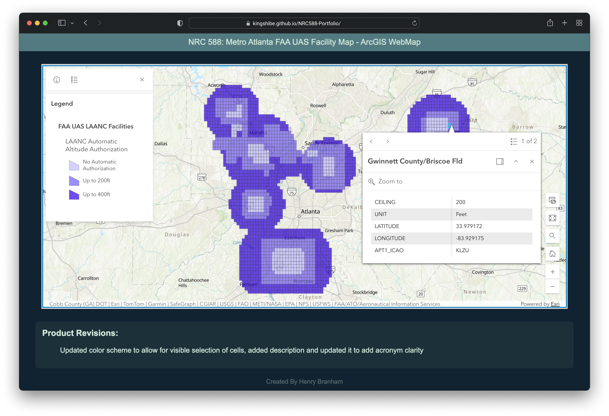

# NRC 588 GIS Portfolio

This is a portfolio of GIS products created for NRC 588 at the University of Massachusetts Amherst. The main page includes a showcase of all three products with each product using specific services and includes the revisions made to each product differing from the original submission.

## Favorite Bondi Beach Cafes - Google Map

This product encapsulates my favorite cafe's in Bondi Beach, NSW, Australia by having clickable markers that display a popup with more information such as name, photo, etc. The markers change color as you hover over them and everything is powered by Google Maps. This product is perfect for cafe lovers!

## Electric Vehicle Charging Stations in Massachusetts - Mapbox

This product was created using Massachusetts electric vehicle charging station data from MassGIS and was imported into Mapbox. When zooming in on the map, the markers change to indicate that they are clickable and when clicked, a popup appears populating data including station name, station street name, and a clickable link for directions to the station's coordinates. This product is perfect for electric vehicle users who are on the go and would like to navigate easily among Massachusetts advanced electric vehicle charging network.

## Metro Atlanta FAA UAS Facility Map - ArcGIS WebMap

This product encompasses displaying knowledge regarding UAS (Unmanned Aerial Systems) flight clearances through the LAANC (Low Altitude Authorization and Notification Capability) system for airports located within Metro Atlanta (Atlanta, GA, USA). The varying colors of grid cells indicate which cells allow no authorization, authorization up to 200 feet, and authorization above 200 feet. This product is perfect for UAS operators within the Metro Atlanta region to ensure proper compliance with federal regulations.

